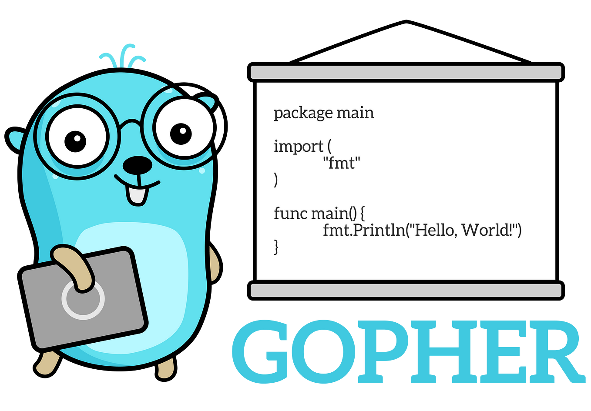

Dilly is my "partner in crime" at work, a fountain of knowledge on all things Site Reliability Engineering and an avid fan of the Go programming language, or perhaps he just has a thing for small blue gophers, who knows?

<!-- truncate -->

Whether Dilly has influenced me or not, I have grown wary of Java and wanted to give something new a whirl, so I have found myself downloading [GoLand](https://www.jetbrains.com/go/) and researching some tutorials to get me started…

