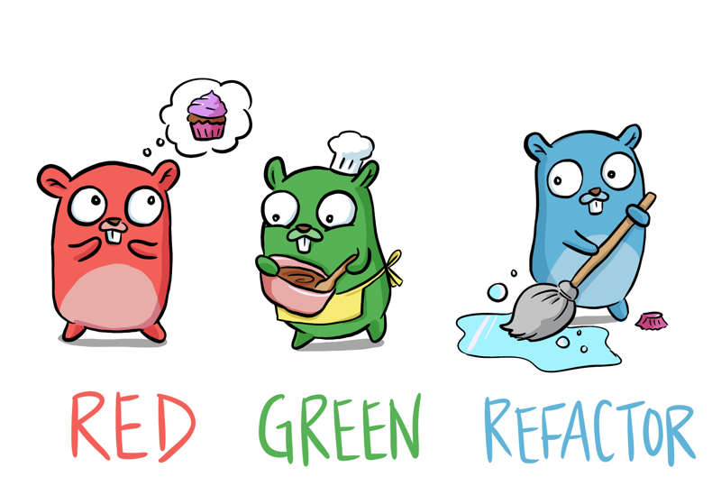

Learn Go with Tests is an excellent [little resource](https://quii.gitbook.io/learn-go-with-tests), book, git repo, blog, one engineer's experience of what worked for them.

<!-- truncate -->

I started and loving it so far, TDD has always been my goto since my early days in Smalltalk, however some languages make it easy, others not so, lets see how Go plays with the concept...

