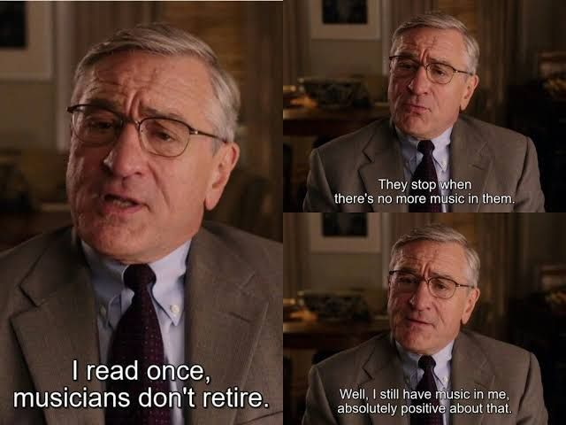

I read once that musicians don't retire. They stop when there is no more music in them. Well, I still have music in me, absolutely positive about that!

<!-- truncate -->

One of the reasons I started this little adventure in Japan was bedded in the fact that the music had become too much of a solo "thing", whilst I am still very much enjoying the moment, I am however locked behind a set of noise cancelling headphones literally, mentally feeling like I have more to offer the world other than an old dude, smiling, bobbing this head and tapping his feet!

The next question though, what can I truly offer? There is no doubt experience is a valuable commodity but it does need upgraded and should never ever (IMHO) become a case of I know better. It's a two way street, an opportunity for you to listen and learn from the newbies and provide them with experience in the form of pitfalls to be avoided rather than "soapboxing".

I do strongly believe you can both teach a young dog old tricks, and an old dog new tricks!

