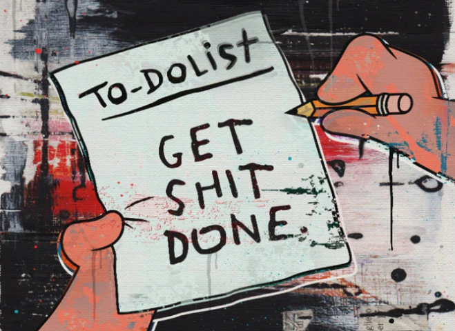

There is a moment, an aha moment, when it all suddenly makes sense - a name, a phrase, just cuts through everything.

<!-- truncate -->

[**Get Shit Done.**](https://opengsd.net/)

I have been doing the product work properly. The [ikigai docs](/docs/ikigai) are all there, and I believe in them. But somewhere in the middle of all that effort I found myself reading about [**GSD**](https://opengsd.net/) — a spec-driven, context-engineering framework for building with AI — and something landed before I had even finished reading the first readme.

There is a Rodney Crowell lyric that has been the compass for this whole thing — *"lately I've learned how to listen, to a sound like the sun going down."* The sun doesn't go down because you scaffolded it. It just does. The learning is in getting out of the way and letting yourself hear it.

[GSD](https://opengsd.net/e) carries the same philosophy. Before a single line of code: discuss, plan, execute. Fresh context every time, no carrying the weight of everything that came before. The framework's whole argument is that what kills most projects is *context rot* — the slow drag of accumulated thinking that eventually pulls the whole thing under.

I have abandoned two repos and given this project three names. I know what context rot feels like.

There is something quietly refreshing about a framework named like a thing you would mutter under your breath.

So, lets go **Get Shit Done...**

>Recent Change - PoliticalCorrectness.morph("Get Shit Done" to: "Git. Ship. Done")