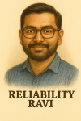

# Product Persona – “Reliability Ravi”

> “If I can’t see it, I can’t keep it reliable. Observability is the backbone of operational excellence.”

---

## 👤 Persona Overview

**Name:** Ravi 
**Role:** Site Reliability Engineer (SRE) 
**Location:** Globally distributed reliability & platform teams 
**Experience:** 5–15 years in reliability, infrastructure, or operations engineering 
**Reports to:** SRE Manager / Engineering Director 
**Team:** SRE, Production Operations, or Platform Engineering 
**Background:** Deep systems knowledge, strong debugging & automation mindset 
**Work Environment:** On-call operations, production systems, cloud platforms 
**Traits:** Analytical, calm under pressure, systems thinker, automation‑driven 

---

## 🎯 Motivations

- Ensure services are reliable, observable, and resilient
- Reduce toil for engineering teams through standards & automation
- Establish enterprise-wide best practices for telemetry
- Quickly detect and resolve incidents with high signal clarity
- Build a sustainable on-call experience

---

## 🏆 Goals

- Centralized, correlated logs, metrics, and traces
- Unified service health views and dependency insights
- Reliable telemetry pipelines (OpenTelemetry Collectors)
- Clear SLOs, SLIs, and alerting policies
- Faster root-cause analysis during incidents
- Shift-left reliability practices for engineering teams

---

## 😣 Frustrations

- Missing or inconsistent telemetry from services
- Multiple monitoring tools creating fragmentation
- Alert noise and poorly defined health checks
- Manual configuration and one-off observability setups
- Lack of dependency mapping during outages
- High operational overhead supporting multiple teams

---

## 📈 Measures of Success

- Reduction in MTTR and improved MTTD
- Stability and scalability of telemetry pipelines
- % of services meeting SLOs
- Reduction in incident volume & repeated issues
- Increased automation and reduced operational toil
- Better on-call experience and actionable alerts

---

> **Summary:**
> Ravi represents the power user of the Observability Platform — responsible for reliability, incident response, and operational excellence. A strong OpenTelemetry-based platform provides the consistency, visibility, and efficiency Riley needs to support the organization at scale.
