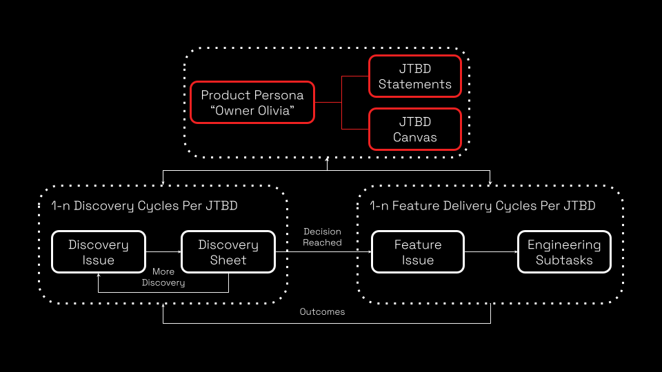

# Getting Started
### Enabling Progress
A great product doesn’t just work, ***it helps someone move forward***, with less friction, more clarity, and deeper trust. Our craft is not just engineering; ***it’s enabling progress.***

By following our lite-weight product operating model to deliver a product which aspires to "***outcomes over outputs***"

1. Clone this [repository](https://github.com/weebaruto/weeproductplaybook) and start building out your own product artifacts and enabling progress.
2. Create your core Product Personas - [Training](./productspeak/product-persona/) and [Examples](./personas/)
3. Create your Jobs-To-Be-Done Statements & "One-Pager" Canvas - [Training](./productspeak/product-jobs-to-be-done/) and [Examples](./jobs-to-be-done/)
4. Iterate through Discovery Cycles, Creating and Logging Decisions - [Training](./productspeak/product-discovery.md) and [Examples](./discovery/)
5. Iterate through Delivery Cycles, Creating & Delivering Features - [Training](./productspeak/product-rhythm.md) and [Examples](./issues/feature.md)

### Tracking & Reporting
Leveraging custom form templates for [Discovery](./issues/discovery.md) and [Feature](./issues/feature.md) Issues provides us with traceability and reporting against Product Personas, Jobs-To-Be-Done, Discovery Decisions and Feature Deliveries; As shown, in the following example for "[Owner Olivia](./issues/)".

>Remember to be practicing your ***[product manifesto](./productspeak/product-manifesto.md) in all your affairs***!

### The Operating Model
