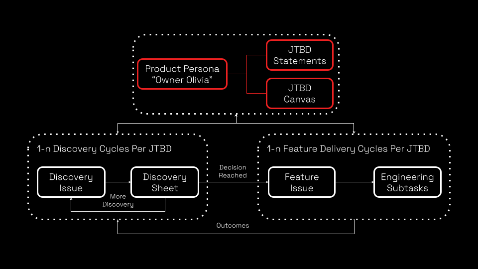

# Product Speak #6 — ProductOps in Git

<strong>“Product Speak” — A Learning Path</strong>

1. Product Personas — Understanding people
2. Jobs-To-Be-Done — Understanding progress
3. Product Manifesto — Shared product ethos
4. Product Discovery — Validating hypothesis
5. Product Rhythm — Sustaining learning loop
6. ***ProductOps in Git — Build around customers***

---

<strong>Today’s Agenda</strong>

- What - The Playbook Repository
- How - The Operating Model

---

<strong>What — The Playbook Repository</strong>

**Content:**
A lightweight product operating model that explains how product decisions are made using personas and Jobs-To-Be-Done so engineering always knows the *why* behind the work.

What You’ll Find Here:
>[product-operating-model-howto.md](./product-operating-model-howto.md) - Instructional content on our product operating model and this repository 
>\docs\\[productspeak](./docs/productspeak/) - Series of product operating model related educational and awareness sessions 
>\docs\\[personas](./docs/personas/) - Example product personas (and template to follow) 
>\docs\\[jobs-to-be-done](./docs/jobs-to-be-done/) - Example Jobs-To-Be-Done artifacts (and templates to follow) 
>\docs\\[discovery](./docs/jobs-to-be-done/) - Example Discovery Cycle artifacts (and templates to follow) 
>\docs\\[issues](./docs/issues/) - Example Discovery and Feature Issues 
>\.github\\[ISSUE_TEMPLATE](.github/ISSUE_TEMPLATE/) - Discovery and Feature Custom Form Templates

---

<strong>How — The Operating Model</strong>

**Enable Progress**\
By following our lite-weight product operating model to deliver a product which aspires to "***outcomes over outputs***"

1. Clone this repository and start building out your own product artifacts and enabling progress.
2. Create your core Product Personas - [Training](./docs/productspeak/productspeak-1-product-persona.md) and [Examples](./docs/personas/readme.md)
3. Create your Jobs-To-Be-Done Statements & "One-Pager" Canvas - [Training](./docs/productspeak/productspeak-2-jobs-to-be-done.md) and [Examples](./docs/jobs-to-be-done/readme.md)
4. Iterate through Discovery Cycles, Creating and Logging Decisions - [Training](./docs/productspeak/productspeak-4-product-discovery.md) and [Examples](./docs/discovery/readme.md)
5. Iterate through Delivery Cycles, Creating & Delivering Features - [Training](./docs/productspeak/productspeak-5-product-rhythm.md) and [Examples](./docs/issues/feature.md)
 

**Tracking & Reporting**\
Leveraging custom form templates for [Discovery](.github/ISSUE_TEMPLATE/discovery.yml) and [Feature](.github/ISSUE_TEMPLATE/feature.yml) Issues provides us with traceability and reporting against Product Personas, Jobs-To-Be-Done, Discovery Decisions and Feature Deliveries; As shown, in the following example for "[Owner Olivia](./docs/issues/)"

>Remember to be practicing your [product manifesto](./docs/productspeak/productspeak-3-product-manifesto.md) ***in all your affairs***!

---

<strong>How — The Operating Model</strong>

